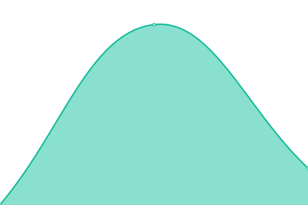

# [📈 Live Status](https://globetrotter-finance.github.io/saras-status): <!--live status--> **🟧 Partial outage**

This repository contains the open-source uptime monitor and status page for [Globetrotter Finance](https://globetrotter-finance.github.io/saras-status), powered by [Upptime](https://github.com/upptime/upptime).

With [Upptime](https://upptime.js.org), you can get your own unlimited and free uptime monitor and status page, powered entirely by a GitHub repository. We use [Issues](https://github.com/globetrotter-finance/saras-status/issues) as incident reports, [Actions](https://github.com/globetrotter-finance/saras-status/actions) as uptime monitors, and [Pages](https://globetrotter-finance.github.io/saras-status) for the status page.

<!--start: status pages-->
<!-- This summary is generated by Upptime (https://github.com/upptime/upptime) -->
<!-- Do not edit this manually, your changes will be overwritten -->
<!-- prettier-ignore -->
| URL | Status | History | Response Time | Uptime |
| --- | ------ | ------- | ------------- | ------ |
|  [GitHub Pages](https://globetrotter-finance.github.io/saras-status/) | 🟥 Down | [git-hub-pages.yml](https://github.com/globetrotter-finance/saras-status/commits/HEAD/history/git-hub-pages.yml) | 

 649ms
     
 | 

<a href="https://globetrotter-finance.github.io/saras-status/history/git-hub-pages">15.07%</a>
    

|  [Backend Services Health 1](https://ind-prod.sarasfinance.com/health) | 🟩 Up | [backend-services-health-1.yml](https://github.com/globetrotter-finance/saras-status/commits/HEAD/history/backend-services-health-1.yml) | 

 839ms
     
 | 

<a href="https://globetrotter-finance.github.io/saras-status/history/backend-services-health-1">100.00%</a>
    

|  [Frontend Application](https://app.sarasfinance.com) | 🟩 Up | [frontend-application.yml](https://github.com/globetrotter-finance/saras-status/commits/HEAD/history/frontend-application.yml) | 

 616ms
     
 | 

<a href="https://globetrotter-finance.github.io/saras-status/history/frontend-application">100.00%</a>
    

<!--end: status pages-->

[**Visit our status website →**](https://globetrotter-finance.github.io/saras-status)

## 📄 License

- Powered by: [Upptime](https://github.com/upptime/upptime)
- Code: [MIT](./LICENSE) © [Anand Chowdhary](https://anandchowdhary.com), supported by [Pabio](https://pabio.com)
- Data in the `./history` directory: [Open Database License](https://opendatacommons.org/licenses/odbl/1-0/)
