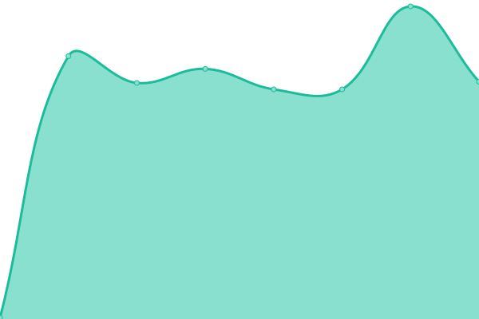
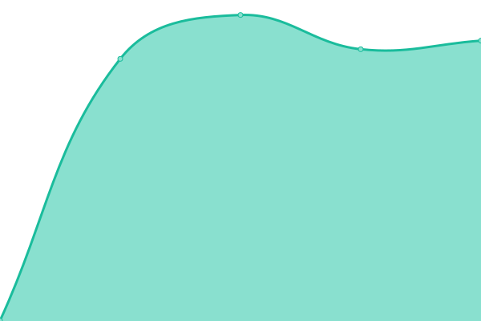

# [📈 Live Status](https://globetrotter-finance.github.io/saras-status): <!--live status--> **🟧 Partial outage**

This repository contains the open-source uptime monitor and status page for [Globetrotter Finance](https://globetrotter-finance.github.io/saras-status), powered by [Upptime](https://github.com/upptime/upptime).

With [Upptime](https://upptime.js.org), you can get your own unlimited and free uptime monitor and status page, powered entirely by a GitHub repository. We use [Issues](https://github.com/globetrotter-finance/saras-status/issues) as incident reports, [Actions](https://github.com/globetrotter-finance/saras-status/actions) as uptime monitors, and [Pages](https://globetrotter-finance.github.io/saras-status) for the status page.

<!--start: status pages-->
<!-- This summary is generated by Upptime (https://github.com/upptime/upptime) -->
<!-- Do not edit this manually, your changes will be overwritten -->
<!-- prettier-ignore -->
| URL | Status | History | Response Time | Uptime |
| --- | ------ | ------- | ------------- | ------ |
|  [--- WEB APPLICATIONS ---](https://group1.invalid) | 🟥 Down | [web-applications.yml](https://github.com/globetrotter-finance/saras-status/commits/HEAD/history/web-applications.yml) | 

 0ms
     
 | 

<a href="https://statuschecks.sarasfinance.com/history/web-applications">0.00%</a>
    

|  [Saras Web App](https://app.sarasfinance.com) | 🟩 Up | [saras-web-app.yml](https://github.com/globetrotter-finance/saras-status/commits/HEAD/history/saras-web-app.yml) | 

 397ms
     
 | 

<a href="https://statuschecks.sarasfinance.com/history/saras-web-app">100.00%</a>
    

|  [Saras Admin App](https://admin.sarasfinance.com) | 🟩 Up | [saras-admin-app.yml](https://github.com/globetrotter-finance/saras-status/commits/HEAD/history/saras-admin-app.yml) | 

 449ms
     
 | 

<a href="https://statuschecks.sarasfinance.com/history/saras-admin-app">100.00%</a>
    

|  [--- PRODUCTION SERVERS ---](https://group2.invalid) | 🟥 Down | [production-servers.yml](https://github.com/globetrotter-finance/saras-status/commits/HEAD/history/production-servers.yml) | 

 0ms
     
 | 

<a href="https://statuschecks.sarasfinance.com/history/production-servers">0.08%</a>
    

|  [Production Backend Services Health](https://ind-prod.sarasfinance.com/health) | 🟩 Up | [production-backend-services-health.yml](https://github.com/globetrotter-finance/saras-status/commits/HEAD/history/production-backend-services-health.yml) | 

 772ms
     
 | 

<a href="https://statuschecks.sarasfinance.com/history/production-backend-services-health">100.00%</a>
    

|  [--- D SERVERS ---](https://group3.invalid) | 🟥 Down | [d-servers.yml](https://github.com/globetrotter-finance/saras-status/commits/HEAD/history/d-servers.yml) | 

 0ms
     
 | 

<a href="https://statuschecks.sarasfinance.com/history/d-servers">0.00%</a>
    

|  [Internal Dev Derver](https://ind-dev.sarasfinance.com/health) | 🟩 Up | [internal-dev-derver.yml](https://github.com/globetrotter-finance/saras-status/commits/HEAD/history/internal-dev-derver.yml) | 

 785ms
     
 | 

<a href="https://statuschecks.sarasfinance.com/history/internal-dev-derver">70.75%</a>
    

<!--end: status pages-->

[**Visit our status website →**](https://globetrotter-finance.github.io/saras-status)

## 📄 License

- Powered by: [Upptime](https://github.com/upptime/upptime)
- Code: [MIT](./LICENSE) © [Anand Chowdhary](https://anandchowdhary.com), supported by [Pabio](https://pabio.com)
- Data in the `./history` directory: [Open Database License](https://opendatacommons.org/licenses/odbl/1-0/)
